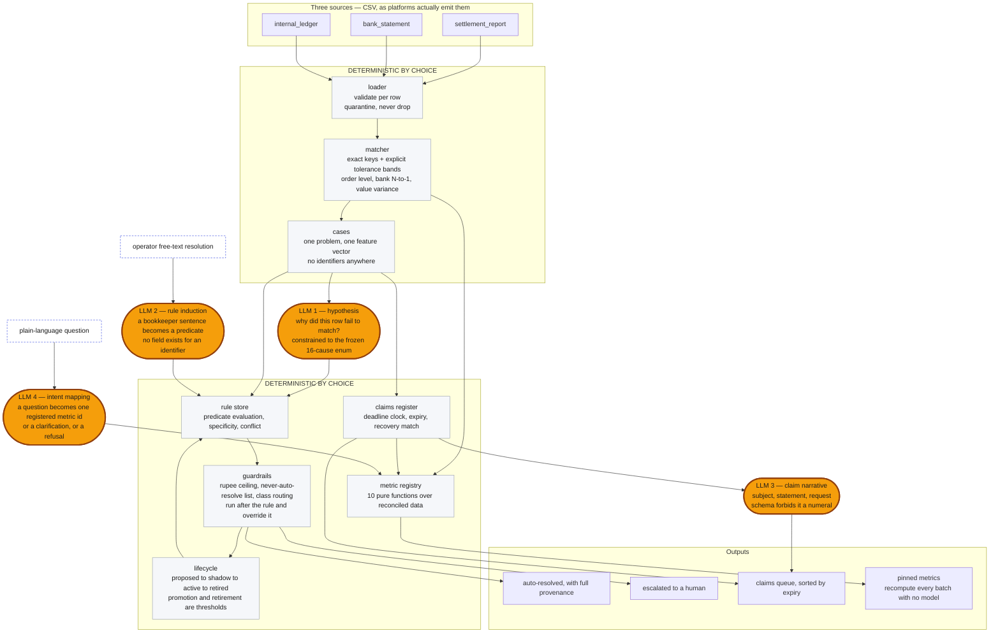

# Tallytrace

**Reconciles 2,409 records across three sources at 69.17% auto-match; learns from 195
operator resolutions to cut human decisions from 22.03% of a batch to 6.08% across ten
batches at 98.63% auto-resolution precision; opens 57 recovery claims on a per-platform
deadline clock, auto-closes 26 of them against the credits that paid them, and escalates
every rupee it cannot account for.**

A reconciliation agent for a multi-channel Indian apparel seller (Amazon, Flipkart,
Myntra, own website, offline POS). It reconciles the platform settlement report, the bank
statement and the seller's own ledger; surfaces what it cannot match; learns from how a
human resolves those exceptions; turns the ones somebody else owes into tracked claims
with a filing deadline; and answers plain-language questions from a fixed metric registry
that refuses what it cannot compute.

Every number on this page comes from `make score` over the ten shipped batches. The
complete, unedited output of that command is in [RESULTS.md](RESULTS.md), regenerated on
every run.

| | |
|---|---|
| Records reconciled | **2,409** across three sources, 1,210 settlement rows |
| Auto-match rate | **69.17%** of settlement rows, matched on exact keys and explicit tolerances |
| Human decisions per batch | **22.03% → 6.08%** of the batch, plateauing above zero |
| Auto-resolution precision | **98.63%** over 146 scored resolutions |
| Rules learned / active / retired | 31 / 9 / **1** |
| Correct abstention on held-out causes | **100%**, both, on first sight and ever |
| Claims opened / recovered / expired | 57 / **26** (₹48,441.58) / 11 (₹17,516.77) |
| Claims still open | 20, ₹35,252.95, **3 expiring within 9 days** |
| Questions asked / mapped / declined | 11 / 8 / **3** — one clarification, two refusals |
| Model spend | ₹160.13 total, **₹0.13 per settlement row** |
| Open, unresolved, itemised | **666 exceptions, ₹498,604.90** — see [EXCEPTIONS.md](EXCEPTIONS.md) |

The two rows separating 98.63% from 100% are the two deliberate near-misses planted in
the dataset. Nothing hides them. [FAILURES.md](FAILURES.md) #21 explains the one done
condition this build does not fully meet and the three shortcuts that would have met it.

---

## Quick start

```bash
make venv           # .venv + pinned dependencies
make demo           # generate, reconcile, learn, claim, score, build the UI data
make reproduce      # run the whole demo twice and diff the artifacts
make check          # clean-base verification, the full test suite, mypy
```

No API key is needed and none is used. `make demo` runs `--offline`, which refuses the
network *even with a key set*, so what it proves is that the committed fixtures and the
seed are sufficient.

```bash
make claims                                                  # the queue, sorted by expiry
make ask q="How much money are we still chasing, by platform?"
cd ui && npm install && npm run dev                          # the dashboard
```

`make ask` answers offline from the committed fixtures, so it answers the eleven
questions in `tools/operator_questions.py` — three of which it declines, on purpose. A
question outside that set raises `CacheMiss` rather than guessing; set
`ANTHROPIC_API_KEY` and drop `--offline` to ask a new one.

<details>
<summary>The individual steps</summary>

```bash
make generate       # ten batches + ground truth, seeded and reproducible
make reconcile      # the matcher across all ten batches
make learn          # the learning loop and the claims register
make resolutions    # rebuild the operator's work log
make reporting      # rebuild the question log and the pinned metrics
make score          # score against the answer key; writes EXCEPTIONS.md + RESULTS.md
make whatif ceiling=3000   # rescore under a different auto-resolution ceiling, writing nothing
make ceilings       # score every candidate ceiling; writes the curve the threshold control reads
make ui-data        # build the JSON the React UI reads
make llm-fixtures   # repopulate data/llm_cache (calls the API if a key is set)
```

</details>

---

## The problem

A seller doing a few crore across four marketplaces looks at two numbers and they do not
agree. In this corpus the books record **₹3,405,263.59** of orders across ten weeks — a
little over ₹34 lakh. **₹2,175,260.07** reached the bank. The gap is
**₹1,230,003.52**, most of it entirely legitimate — and the seller cannot tell you which
part is not.

That is the whole problem in one line. The gap is not one thing, and that is precisely
why it goes unreconciled:

- **Commission** is charged per category at a rate the platform can change without
  telling anyone who updates the seller's master rate sheet. In this corpus that is 129
  exceptions — by far the largest cause — and every one is a rate that moved on their
  side and did not move in the books.
- **GST on that commission** at 18%, **TCS** at 1% under section 52, and **TDS** at 0.1%
  under 194-O, each landing on its own cycle. The effective take rate here is
  **29.92% on Myntra and 2.23% on the own website**, and almost none of that difference
  is visible on an order page.
- **RTO reversals** claw back the full order value one to three weeks after the sale
  settled at full value. 54 exceptions. The books never recorded a refund, so nothing
  nets off.
- **Settlement lag** puts the sale in one weekly file and the payout in another. 48
  exceptions, and the reason the matcher has to carry an open book across batches rather
  than reconcile one file against itself.
- **Weight-dispute holds** report the order as sold, retain the commission, and pay out
  nothing. Held, not lost — and invisible unless somebody is counting.
- **Short payments with nothing on the report to explain them.** The residual. Somebody
  owes this money and there is a window in which to ask for it.

The last two are why a claims queue matters more than a chart. Amazon's SAFE-T window is
30 days from the event; a TCS discrepancy has to be raised before the 10th of the
following month or the GSTR-8 correction misses its return. Sellers lose this money
because they only discover the loss at reconciliation time, which is already late. In
this corpus, **₹17,516.77 across 11 claims expired unrecovered** — and that number exists
only because something was counting the days.

---

## What already exists

Deterministic reconciliation is a solved problem and this repo does not pretend
otherwise.

**Unicommerce** and **EasyEcom** already do multi-channel payment reconciliation for
Indian sellers, with real marketplace integrations this project simulates with CSVs.
**BlackLine** has run account reconciliation at enterprise scale for two decades and
publishes auto-certification rates. **Numeric** and its peers do AI-assisted close work,
including learning from how a controller resolves an item — the loop in this repo is not
a new idea, it is an idea that exists upmarket.

**There is no novelty claim here.** The claim is one about segment. Learning from
operator corrections, a deadline-tracked claims register and a governed reporting surface
exist together at enterprise price points and multi-month implementations. They do not
exist for a seller doing a few crore across four channels, who is reconciling in a
spreadsheet and finding out about a SAFE-T window after it has closed. That gap is the
whole thesis, and it is a distribution argument rather than a technical one.

The one design position worth defending on its merits is where the model is allowed to
act. That is what the diagram two sections down is organised around, and what the section
after it argues.

---

## Benchmarking against what exists

Putting your own number next to a published one is uncomfortable and it is the only way
the number means anything.

| | this build | published comparison |
|---|---|---|
| Auto-match on exact keys and tolerances | **69.17%** of settlement rows | — |
| Auto-resolution precision | **98.63%** over 146 scored resolutions | — |
| Share of items closed without a human | **12.07%** of settlement rows across the corpus | BlackLine reports **43–85%** auto-certification |
| Human decisions per batch | **22.03% → 6.08%** | — |

**The honest reading of that middle row: this build is well below the incumbent range,
and the comparison is not like for like in either direction.** BlackLine's
auto-certification covers whole reconciliations that tie out under a materiality rule —
the equivalent here is the 69.17% auto-match, not the 12.07%. The 12.07% is a narrower
and harder number: exceptions that already failed a deterministic match and were then
closed by a rule induced from a human's sentence. Quoting 69.17% against 43–85% would be
the flattering comparison and would compare two different things.

The third row is also the one a build could game, and the reason it sits where it does is
the guardrails. Anything above the ₹500 default variance ceiling is refused automation
however confident the rule is, so the system automates volume and escalates value:
**₹8,203.42 auto-resolved against ₹490,401.48 escalated.** Raising that ceiling moves
12.07% toward 43% overnight, and `make whatif ceiling=3000` will show you exactly how far.
That is a decision about risk appetite and it belongs to the business, not to this
README — so the ceiling is a number they set, per cause and per channel, and every run
prints the policy it ran under. What the shipped default asserts is only that ₹500 is
where *this* seller drew the line. See
[Ceilings are set by the business](#ceilings-are-set-by-the-business-not-by-the-rule).

---

## Architecture, drawn on the AI boundary

Four shaded nodes. Everything else is deterministic, and it is deterministic because it
was chosen to be, not because a model was unavailable.



<details>
<summary>The same thing in ASCII, for anyone reading this in a terminal</summary>

```
   ═══ shaded: the four LLM call sites, all natural-language boundaries
   ─── plain:  deterministic by choice

   settlement_report ┐
   bank_statement    ├──> loader ──> matcher ──> cases
   internal_ledger   ┘                             │
                                                   ├──> ╔═══════════════╗
                                                   │    ║ 1  hypothesis ║ ──┐
                                                   │    ╚═══════════════╝   │
   operator's note ─────────> ╔═══════════════╗    │                        │
                              ║ 2  induction  ║ ───┼────────────────────────┤
                              ╚═══════════════╝    │                        │
                                                   v                        v
                                                   └──────────────────> rule store
                                                                            │
                                                                            v
                                                                       guardrails
                                                                            │
                          auto-resolved (+ provenance)  <───────────────────┤
                          escalated to a human          <───────────────────┤
                          lifecycle ──> back to rule store  <───────────────┘

   cases ──> claims register ──┬──> ╔════════════════╗
                               │    ║ 3  claim draft ║ ───┐
                               │    ╚════════════════╝    │
                               └──────────────────────────┴──> claims queue, by expiry

   question ──> ╔════════════════╗
                ║ 4  intent map  ║ ──> metric registry ──> pinned metrics
                ╚════════════════╝            ^            (no model, ever again)
                                              │
                              matcher and claims register feed it
```

</details>

The shaded nodes are the only places a model is called, and `tests/test_boundaries.py`
fails if the `anthropic` import appears anywhere but `pipeline/llm/`. Everything in the
two plain boxes is arithmetic over config: no probabilistic linkage, no learned
thresholds, no model in any path that decides what happens to money.

Note what the arrows do *not* do. Nothing flows from a shaded node to an output without
passing through a plain one first. The hypothesis reaches the rule store and the rule
store reaches the guardrails; the claim narrative reaches the queue only after the
register has already decided the claim exists, what it is worth and when it expires.

---

## Where the model is used, and where it is deliberately not

### Used, in four places, all of them natural-language boundaries

**1. Hypothesis generation** — *why did this row fail to match?* The matcher produces an
observation ("fee off by ₹132.44, outside a ₹7.51 band"); the model turns it into a cause
a bookkeeper would recognise. Constrained to the 16-cause frozen enum **in the JSON
schema**, not in the prompt text, so a cause outside it fails validation and raises rather
than reaching a human wearing a confidence score. Deduplicated by question shape: 400-odd
exceptions ask 45 distinct questions.

**2. Rule induction** — *what does this sentence mean as a predicate?* The input is what
a bookkeeper typed while clearing an exception, in their own words. The output is a
structured rule with bands. The model does not decide whether the rule may fire, does not
set its state, and never evaluates it. The schema has no field for an identifier, and
`assert_generalisable` re-checks the free-text values, because a `plain_words` field will
hold `ord_000019` quite happily if nobody looks.

**3. Claim drafting** — *the words around the evidence.* Three short strings: a subject, a
factual statement of the discrepancy, a request. **The schema rejects any numeral in any
field.** Every figure in a finished claim letter — the order reference, the settlement
rows, expected against received, the amount claimed, the filing deadline — is substituted
by `pipeline/claims/drafting.py` from the matcher's own verdicts. A rupee figure a
language model typed is a rupee figure nobody computed, and one wrong rupee in a claim is
the whole claim. `tests/test_claims.py` takes the drafts a real run produced and asserts
every numeric token in them traces back to the claim or its evidence rows.

**4. Intent mapping** — *which registered metric answers this question?* The model selects
an id from a list of ten and sets parameters. It has three outcomes and only one of them
is an answer: map, ask exactly one clarifying question, or refuse.

### Not used, in six places, each for a reason

**Matching.** Money does not want probabilistic matches. A 0.87-confidence match is not a
match, it is a liability: it books money against an order nobody chose, and the audit
trail reads "the algorithm was fairly sure". Exact keys plus explicit tolerance bands,
and `tests/test_boundaries.py` greps for `rapidfuzz`, `recordlinkage`, `difflib` and
friends across the whole tree.

**Applying learned rules.** Induction is language work; application is a comparison of
numbers. `pipeline/rules/` cannot reach a model client at all — asserted by a test — so
rule matching cannot quietly become a second opinion.

**Deciding whether something may be auto-resolved.** Thresholds are code and they run
*after* the rule has already won, so they can only take the decision away from it. A
rule's confidence is an opinion about a pattern; a threshold is a decision about risk, and
the opinion never wins.

**Computing any metric.** The registry computes; the model only selects. Ten pure
functions over the reconciled data, and `pipeline/metrics/` cannot construct a client
either.

**Generating SQL.** Enterprise text-to-SQL execution accuracy runs roughly **21–39%** on
realistic schemas, and its failures are silent — a valid query returns a plausible wrong
number and nothing on screen says so. A closed registry can be wrong in exactly one way,
picking the wrong id out of ten, and the restatement puts that choice in front of a human
before anything runs. There is no database in this repo and a test fails if a SQL engine
is ever imported.

**The claims clock.** Deadlines come from `config/thresholds.yaml` and a calendar. A
platform with no configured filing window gets **no deadline at all** rather than a
plausible default, because a claims queue whose entire value is its clock cannot afford
one clock that was made up.

### The enforcement

Nine tests in `tests/test_boundaries.py` plus one in `tests/test_llm.py`. No mocking —
just greps and imports over the source tree:

| assertion | what it prevents |
|---|---|
| `anthropic` imported only under `pipeline/llm/` | a model call anywhere else |
| `pipeline/rules/` cannot import the client (`test_llm.py`) | rule application becoming probabilistic |
| `pipeline/metrics/` cannot import the client | a metric that asks instead of computing |
| `pipeline/claims/` cannot import the client | the deadline clock depending on an API |
| no fuzzy-matching library anywhere | probabilistic linkage of money |
| no SQL engine anywhere | text-to-SQL arriving through the back door |
| `pipeline/` never names the answer-key path | a matcher that can see the answers |
| `harness/truth.py` is its only reader, `generator/main.py` its only writer | a two-line answer to "who could have touched the answers?" |

---

## Results

The complete, unedited output of `make score` is in **[RESULTS.md](RESULTS.md)**,
rewritten on every run. Three tables out of it are worth putting here.

**What the matcher alone leaves, and what is left after learned rules fire.** Two
columns, deliberately, so that a decline that came from widening a tolerance cannot be
mistaken for one that came from learning.

```
ACCURACY — BUCKETS AND RATES, AS A PERCENTAGE OF BATCH TOTAL
------------------------------------------------------------------------------
batch  settle  match  var  unmat  quar  auto-match   review  auto  net review  new  aged  carried
    1      59     48   10      1     0      81.36%   18.64%     0      18.64%   23     0      118
    2      75     58   14      2     1      77.33%   22.67%     0      22.67%   31     0      145
    3      87     65   16      6     0      74.71%   25.29%     6      18.39%   38     0      165
    4     102     69   23      9     1      67.65%   32.35%     7      25.49%   58     0      188
    5     114     80   26      8     0      70.18%   29.82%     9      21.93%   67     0      188
    6     128     93   26      8     1      72.66%   27.34%    19      12.50%   67     2      197
    7     141     99   31     11     0      70.21%   29.79%    21      14.89%   77     2      223
    8     155    107   37     10     1      69.03%   30.97%    24      15.48%   88     2      202
    9     168    113   40     14     1      67.26%   32.74%    25      17.86%  100     3      114
   10     181    105   43     33     0      58.01%   41.99%    35      22.65%  117     3        0
------------------------------------------------------------------------------
       batch 1 auto-match 81.36%, review 18.64%  ->  batch 10 auto-match 58.01%, review 41.99%
       review rate is a measurement, not a target. Nothing here is tuned to move it.
       'review' is what the matcher alone leaves; 'net review' is what is left after
       learned rules auto-resolve. Two columns, so a decline that came from widening
       a tolerance cannot be mistaken for one that came from learning.
       'new' is findings raised this batch across all three tables; 'aged' is the same problems still
       open from earlier batches; 'carried' is orders inside their window, which are not exceptions.
```

**What a rule closed, and whether it was right.** `touch %` is the number the product is
about: distinct decisions a human has to make, as a share of the batch. It falls 22.03% →
6.08% while precision holds.

```
LEARNING LOOP — WHAT A RULE CLOSED, AND WHETHER IT WAS RIGHT
------------------------------------------------------------------------------
batch  queue  auto  held   esc  precision  ₹ auto-resolved    ₹ escalated  learn  prom  ret  cards  touch  touch %
    1     13     0     0    13          —            ₹0.00      ₹33776.99      6     0    0      0     13   22.03%
    2     17     0     0    17          —            ₹0.00      ₹11893.62      4     2    0      2     17   22.67%
    3     22     6     4    16    100.00%          ₹585.10      ₹17674.33      5     0    1      3     14   16.09%
    4     35     7     4    28    100.00%          ₹663.96      ₹65010.84      5     0    0      7     26   25.49%
    5     41     9     5    32     88.89%          ₹821.59      ₹41170.78      3     3    0      7     29   25.44%
    6     41    19     9    22    100.00%          ₹977.28      ₹43724.91      2     1    0      7     18   14.06%
    7     46    21    16    25    100.00%         ₹1146.23      ₹43374.46      3     1    0      7     15   10.64%
    8     51    24    19    27     95.83%         ₹1388.81      ₹42916.64      0     2    0     10     15    9.68%
    9     60    25    26    35    100.00%         ₹1280.55      ₹70234.52      3     0    0      8     16    9.52%
   10     74    35    33    39    100.00%         ₹1339.90     ₹120624.39      0     0    0      8     11    6.08%
------------------------------------------------------------------------------
       overall auto-resolution precision 98.63% over 146 scored resolutions.
```

**The claims register.** `₹ open` is the standing balance, not a cumulative total — it
goes down when claims recover and when they expire, and only one of those is good news.

```
CLAIMS QUEUE — OPENED, RECOVERED, EXPIRED, AND THE MONEY ON EACH
------------------------------------------------------------------------------
batch  opened  draft  filed  recov  exp      ₹ opened    ₹ recovered    ₹ expired  open       ₹ open
    1       2      2      2      0    0      ₹5866.21          ₹0.00        ₹0.00     2     ₹5866.21
    2       2      2      2      0    0       ₹717.48          ₹0.00        ₹0.00     4     ₹6583.69
    3       1      0      1      0    0        ₹19.51          ₹0.00        ₹0.00     5     ₹6603.20
    4       3      3      2      1    0      ₹6741.44        ₹287.97        ₹0.00     7    ₹13056.67
    5       9      9      6      0    1     ₹16562.80          ₹0.00       ₹19.51    15    ₹29599.96
    6       6      6      2      5    2     ₹13028.37      ₹11769.13     ₹5866.21    14    ₹24992.99
    7       8      7      6      6    1      ₹8933.37      ₹13028.37      ₹429.51    15    ₹20468.48
    8       9      9      7      4    0     ₹12564.46       ₹8363.13        ₹0.00    20    ₹24669.81
    9      12     12      6      3    3     ₹21829.21       ₹4123.63     ₹6741.44    26    ₹35633.95
   10       5      5      4      7    4     ₹14948.45      ₹10869.35     ₹4460.10    20    ₹35252.95
------------------------------------------------------------------------------
       57 claims opened. 26 recovered (₹48441.58), 11 expired (₹17516.77), 20 still open.
       recovery rate on settled claims: 70.27%. Open claims are not counted as either;
       a claim inside its window is not yet a result.
```

Three more tables in RESULTS.md deserve a look and none of them flatters the build: the
cause-level confusion table (which bucket each injected trouble actually landed in), the
silent-clear table (48 injected rows the matcher called clean, with the tightest headroom
that permitted it), and the claim attribution table (which is discussed under
Limitations, below, because it is the worst number here).

---

## What is in the data

Ten weekly batches built as **clean base + injected troubles**, with a separate
ground-truth key recording every injection.

| | |
|---|---|
| Settlement rows per batch | 59 → 181, monotonic, every batch over the 50-record floor |
| Bank credits | 150, largest aggregating 72 settlement rows (a real N:1 join) |
| Ledger rows | 1049 orders |
| Injected troubles | 371 affected rows across 16 causes, ₹4.6L of true impact |
| Malformed rows | 5, spread across batches 2, 4, 6, 8 and 9 |
| Planted claim recoveries | 5 reimbursements landing 2–4 batches after the loss |

### Layout

```
config/     thresholds.yaml, causes.yaml, channels.yaml, generation.yaml, pricing.yaml
data/
  generated/        batch_01 .. batch_10, three CSVs each
  truth/            the answer key — PIPELINE MUST NEVER READ THIS
  llm_cache/        cached model responses, committed: this is what makes a rerun free
  resolutions.json  the operator's own words; the root of every provenance chain
  questions.json    what the operator asked the reporting surface
  pins.json         pinned metric definitions — ids and parameters, never numbers
generator/  synthetic world, injectors, writer, clean-base verifier
pipeline/   models.py, config.py, loader.py, run.py, cases.py, learn.py
  matcher/    deterministic matching
  llm/        the only place a model may be called
  rules/      induction targets, lifecycle, predicates, guardrails, provenance
  claims/     routing, the two deadline clocks, recovery matching, drafting
  metrics/    the metric registry, the corpus it computes over, pins
harness/    scoring: reads data/truth, which the pipeline never does
tools/      fixture and artifact builders, the ask CLI, the reproducibility check
ui/         React dashboard, fed by one scored run
tests/      380 test functions, 412 cases
```

Four artifacts leave a run and all four are committed: `EXCEPTIONS.md` (what it could not
resolve, itemised), `RESULTS.md` (the harness output verbatim), `FAILURES.md` (kept by
hand since checkpoint 1) and `data/score.json` (every number, every amount a string).

---

## Design decisions worth knowing

**The matcher must read the ledger cumulatively.** A settlement row lands in the batch
its payout fell into; a ledger row lands in the batch the order was booked in. An order
booked in batch 3 and paid in batch 5 therefore appears in two different files. This is
the point — it is what makes cross-batch settlement lag real rather than a story — but it
means reconciling batch N requires ledger rows from batches 1..N, not batch N alone.

**Batch size means settlement rows.** That is the table whose rows get bucketed as
matched / variance / unmatched / quarantined, and the denominator the review rate is a
percentage of. Total records per batch (all three tables) is larger, between roughly 220
and 250.

**The corpus is closed.** Every order generated settles inside the ten batches, which is
what lets the clean base reconcile at exactly 100%. The cost is at the edges: batch 1
carries a large opening book (173 ledger rows created before the corpus starts), and
batch 10's ledger is small (24 rows) because an order booked in the final week has no
later cycle to settle in. Cross-batch causes are correspondingly thin at both ends — see
FAILURES.md #6.

**Money is `Decimal`, everywhere, and floats are refused rather than converted.**
`pipeline/models.py` raises on a float in any money field, on construction and on
assignment. Config YAML floats are parsed as `Decimal` too, so a commission rate cannot
enter the system as binary floating point. Rounding is half-up, not banker's.

**The clean base reconciles at 100% before anything is injected.** `make verify-clean`
proves it: every booked order settles for exactly what the books expect, every fee equals
the ledger's own derivation, no settlement row points at an unknown order, and every
payout group ties to exactly one bank credit. It is written against the emitted world
rather than reusing the code that built it, so a builder bug cannot cancel itself out. If
this does not come back clean, nothing downstream is worth debugging.

**The ground truth records what was done, not how hard it is.** Each entry holds the
affected row ids, the true cause, the true rupee impact and the correct resolution class.
It records no claim about whether a matcher *should* catch it — that is the harness's
finding, not the dataset's assertion. A test asserts the entry keys stay exactly that.


---

## The matcher

`make reconcile` walks the ten batches in order and buckets every row. Batch 1 matches
81% of its settlement rows; batch 10 matches 58%, because it receives every cross-batch
reversal and refund lag planted in batches 8 and 9 and emits none of its own.

### Four buckets, one reason code each

Every input row lands in exactly one of `matched`, `variance`, `unmatched` or
`quarantined`, with a machine-readable reason code saying which check produced the
verdict. `assert_one_bucket_each` enforces the "exactly one" in code, and a test asserts
the row count going in equals the row count coming out, per table, per batch.

Reason codes are not causes. A cause is what the answer key says was done to the data; a
reason is what the matcher observed. Keeping them apart is what lets the harness ask
"which bucket did cause X land in?" and get a real answer instead of a tautology.

### No fuzzy matching. Anywhere. On purpose.

Order level is an exact key. Bank level is an exact key plus an explicit rupee tolerance.
There is no similarity score, no probabilistic linkage, no `recordlinkage`. In finance a
0.87-confidence match is not a match, it is a liability: it books money against an order
nobody chose to book it against, and the audit trail reads "the algorithm was fairly
sure". `test_matching_never_becomes_probabilistic` greps the tree for the usual libraries
and fails on a hit.

### The N:1 join, and what happens when it does not tie out

150 payout groups across the corpus, 147 tying out within ₹1.00. The widest aggregates 72
settlement rows. When a group does not tie out, reporting "off by ₹1,698.04" is not useful
to a bookkeeper — so the matcher runs a **bounded** residual search (a greedy pass, then
short combinations, both capped by `subset_search` in `thresholds.yaml`) and names the
rows the credit does not account for. When the bounded search finds nothing it says so:
shortfall, full candidate list, `search_exhausted: true`. It never widens the search until
something fits. An invented explanation is worse than an unresolved one.

### Late is not lost

A settlement arriving inside `date_window_days` of its order is a settlement cycle, not
missing money, and is never flagged. Past the window it is flagged — as a `variance` with
an impact of ₹0.00, because the money is right and only the timing is wrong. An order that
has not settled at all and is still inside its window is carried forward, not queued: it
is not a human's problem until the window has actually elapsed.

### Tolerances come from the ledger, not from a constant

The value-level band is a percentage of the order's own `expected_fee` — which is
`order_value * expected_commission_rate` — with the rounding tolerance as a floor. A stale
rate therefore produces a variance *proportional to the order*, which is what makes fifty
stale-rate exceptions look like one rule rather than fifty coincidences.

### Purity, and where the I/O lives

Nothing under `pipeline/matcher/` opens a file, reads a clock or draws a random number;
`test_the_matcher_package_performs_no_io` greps for all three. CSV reading is in
`pipeline/loader.py`, cross-batch state is in `pipeline/run.py`, and the matcher is handed
a self-contained universe. That is what makes "deterministic by choice" checkable rather
than asserted.

Nothing goes through pandas either. A pandas column of `Decimal` is an object column with
float coercion one careless operation away, and the money-is-never-a-float rule is worth
more than the ergonomics.

### Quarantine, never drop

Rows are validated one at a time, so one malformed row cannot take its table with it. A
row the models refuse is parked with a named reason (`malformed_unparseable_date`,
`malformed_missing_order_id`, …), the raw text kept for a human, and counted. The five
corruptions planted by the generator all land there.


---

## The harness

`make score` runs the pipeline across all ten batches, scores it against
`data/truth`, prints a report and writes `EXCEPTIONS.md` and `data/score.json`.

It was built **before** the learning loop, not after, and that is the whole point.
Built afterwards a harness becomes a thing that confirms what you hoped. Built first
it is a thing that catches what went wrong — four of the six defects in FAILURES.md
#7–#14 were found by pointing it at code that passed all of its own tests.

### What it reports

| | |
|---|---|
| Auto-match rate | 81.4% in batch 1, 58.0% by batch 10 |
| Review rate | percentage of **settlement rows**, so a growing batch does not flatter it |
| Cause-level confusion | which bucket each of the 371 injected rows actually landed in |
| Silent clears | 48 rows, with the tightest headroom that let each one through |
| Throughput | records/second per batch, plus token cost per reconciled transaction |
| Honesty | 666 open exceptions itemised in `EXCEPTIONS.md`, 5 rows quarantined with reasons |
| Matcher precision | 658 of 666 findings trace to an injection; the other 8 are the quarantined rows and the bank side of the duplicates |

The declining match rate is the corpus behaving as designed, not the matcher
degrading: batch 10 receives every cross-batch reversal and refund lag planted in
batches 8 and 9 and emits none of its own.

### Silent clears, and why the count alone is useless

A silent clear is "the number that tells you your tolerance band is wrong". A count
cannot tell you that — every silently cleared row is inside a tolerance by
definition, since that is what `matched` means. So the harness reports the **tightest
headroom** beside it: the smallest gap between a cleared row's deviation and the band
that permitted it.

`rounding_variance` clears with as little as **₹0.16 of headroom under the ₹1.00
floor** — one injected paise drift came within sixteen paise of firing.
`settlement_lag_crossing_batch` clears at ₹0.00 deviation with the band untouched.
Both are inside a band on purpose; only the first is a band worth arguing about. No
threshold was changed in either direction.

### New findings versus aged ones

An order that goes overdue in batch 5 and is never paid is correctly unmatched in
batches 5 through 10 — the ledger row is an input in each of them, and every input row
gets a verdict. That is right for the bucket contract and wrong for a review queue:
three missing settlements would otherwise appear as 39 queue entries.

`harness/aging.py` splits them. A finding is *new* the first time a row carries a
reason and *aged* after; the queue counts new findings, the report shows aged ones in
their own column, and `EXCEPTIONS.md` itemises each once in the batch it was raised.
The split lives in the harness because the matcher is a pure function of one batch and
cannot know it has seen a row before — the harness sees all ten and can.

### Determinism, and the one part that is not

Wall clock is a required metric and cannot be reproducible. Rather than drop it, it is
segregated: `data/score.json` carries a single `timings` block marked
`"reproducible": false`, and everything else in the file is byte-identical run to run.
Two tests assert it — one strips the block and compares the rest, the other asserts no
float appears anywhere outside it.

### The features the learning loop reads

The matcher emits the features a learned rule is written in, so induction and
application cannot each invent their own definition of the same band:

- `fee_variance_pct` / `net_variance_pct` — the percentage a commission rule is stated
  in. `None`, not `0.00%`, when the books expected nothing: a percentage of zero is
  undefined, and zero would read as "no variance" on the rows with the largest one.
- `days_after_settlement` / `days_since_order` on a deduction that arrives after its
  order closed — because in this corpus each lag cause was injected on a single
  channel, and a rule induced on the channel would score 100% having learned the
  injection plan rather than the phenomenon.
- `review_rate` and `net_review_rate` as separate series. The first is the matcher's
  own number and must not move; the second subtracts what rules resolved. One column
  cannot tell a decline earned by learning from one bought by widening a tolerance.

Three properties the learning loop depends on are held in place by tests, because each
is a dataset property nothing else would notice breaking: the stale-rate band is a
point per channel (8.80% Myntra, 7.50% Amazon), the held-out promo cause sits outside
it at 25–40%, and the near-miss sits exactly inside it on the same channel.

---

## The learning loop

Eight steps per batch, in this order, and the order is the product.

1. **Reconcile.** The matcher runs, and nothing downstream can change a bucket.
2. **Build the queue.** Verdicts are grouped into **cases** — a wrong commission rate
   produces a verdict on the settlement row and one on the ledger row, and a bookkeeper
   works that once. New findings only; an order overdue for four weeks is one problem.
3. **Hypothesise.** Every readable case gets a cause and a plain-English explanation
   from the model, constrained to the frozen enum by the schema.
4. **Decide.** The rule store is consulted. Active rules may auto-resolve, subject to
   the guardrails; shadow rules predict and log; an unmatched case goes to a human
   untouched.
5. **Card decisions.** What the operator did with last week's proposals is applied.
6. **Claims.** Everything the routing sends to a counterparty goes to the register: this
   batch's credits close earlier claims, elapsed windows expire, new claims open and get
   a draft. The learning loop and the claims queue are two destinations off one routing
   decision, not two pipelines.
7. **Resolve.** The operator's free text for this batch is read, shadow predictions on
   those cases are judged against what the human actually said, and new rules are
   induced from any resolution that does not corroborate a rule already held.
8. **Advance.** Every rule's lifecycle state is recomputed from its record.

Step 4 before step 7 matters: a rule must predict *before* it is told the answer, or its
precision measures nothing. Step 8 last, so a rule promoted this week starts firing next
week rather than retroactively.

### The lifecycle, and why the lag is the point

`proposed` → `shadow` → `active` → `retired`. A rule induced in batch 1 shadows batch 2
and fires from batch 3 at the earliest. Promotion needs both
`promotion_min_confirmations` **and** `promotion_min_precision`; volume alone is not
evidence, and a shadow prediction nobody has ruled on is not a confirmation.

Retirement is automatic and it is shown, not hidden. **R-07** was induced in batch 2
from a note that generalised across every marketplace, predicted on six late deductions
in batch 3, was contradicted by the operator's own Amazon resolutions, and retired
itself at 40.00% precision over five judged observations. The rules page carries it with
its reason, in a red-railed row under a footnote naming it — a working mechanism rather
than an incident, which is why it is not a banner. `FAILURES.md` #24 has the full story,
including why the note that caused it was not quietly rewritten.

### Guardrails run after the rule matches, and they override it

That ordering is the whole design. A rule's confidence is an opinion about a pattern; a
threshold is a decision about risk, and the opinion never wins. All three are evaluated
every time, pass or fail — a short circuit would lose the record, and "which guardrails
did you check?" is a question asked about the resolutions that went *through*.

| guardrail | source | effect |
|---|---|---|
| `max_variance_inr` | `config/thresholds.yaml` | above ₹500 by default, never auto-resolve — set per cause and per channel |
| `never_auto_resolve_causes` | same | TCS, TDS and chargebacks, whatever a rule believes |
| resolution class | `config/causes.yaml` | `tax_review`, `investigate` and `counterparty_claim` are always human |

The third includes claims deliberately: closing a row someone else owes money on is not
a resolution, it is a write-off nobody authorised.

The visible consequence is that the system **automates volume and escalates value** —
₹8,203 auto-resolved against ₹490,401 escalated across the corpus. That is the
guardrails working, not a limitation, and the report prints both figures beside each
other so the ratio cannot be quietly inverted.

### Ceilings are set by the business, not by the rule

One ceiling for every case is a policy about the average case, and there is no average
case. A stale commission rate is arithmetic somebody can check against a rate card; a
four-figure clawback on a marketplace return is money at risk until someone confirms the
return happened. Holding both to ₹500 is a coincidence, not a judgement.

So `max_variance_inr` is a default, and finance sets ceilings under it:

```yaml
# config/thresholds.yaml
auto_resolution:
  max_variance_inr: 500.00            # the default: governs anything below
  max_variance_overrides:
    - cause: commission_rate_stale
      max_variance_inr: 1500.00
      set_by: finance.head@demostore.in
      note: A rate that moved is arithmetic we can check, not a dispute.
    - channel: offline
      max_variance_inr: 0.00          # nothing at the counter closes itself
      set_by: finance.head@demostore.in
```

Four properties, and each one exists because the alternative fails in a specific way:

- **Most specific wins, and a tie goes to the stricter.** `cause` + `channel` beats
  either alone, which beats the default. A cause-scoped and a channel-scoped ceiling are
  equally specific and can meet on one case — `commission_rate_stale` at ₹1,500 and
  `offline` at ₹0 meet on an offline commission variance — and there the lower one
  governs. Both are your policy and neither is aimed more precisely, so the tie resolves
  toward the person, which is the same direction `predicates.select` resolves a tie
  between two equally specific *rules* (there it escalates, because a rule tie has no
  safe merge; here it takes the safe one). Specificity then amount is a total order, so
  file order never decides. The same scope set twice is a load error.
- **A scope that could never fire is a load error.** A cause or channel outside the
  frozen enums is rejected rather than accepted-and-ignored. A typo that presents as a
  ceiling silently never applying is the worst way for this number to be wrong.
- **A ceiling is not a master switch.** It is one of three guardrails. Setting ₹99,999
  for `chargeback_deduction` does not make chargebacks automatable — the cause list and
  the resolution class still hold, and `test_a_scoped_ceiling_cannot_lift_a_blocked_cause_or_class`
  is what says so.
- **It cannot be invisible.** The governing ceiling and who set it are written into the
  guardrail detail of every decision it touched, so the decision path in the UI reads
  `₹612.00 is above the ₹500.00 ceiling for cause=rto_reversal_later_cycle, set by
  finance.head@demostore.in`. The score report opens with the policy in force, and the
  dashboard reads the number off the run rather than hardcoding it.

`0.00` disables auto-resolution for a scope entirely — a legitimate setting, and the one
to reach for when the objection is "not this cause, not ever" rather than "not this much".

**Trying it is not the same as deciding it.** `make whatif ceiling=3000` scores the whole
corpus at a different default and prints the report; it writes nothing, because
`RESULTS.md`, `EXCEPTIONS.md` and `data/score.json` are the committed record of the
shipped policy and the figures on this page are quoted out of them. Changing
`config/thresholds.yaml` *is* the decision, and that regenerates them normally.

**And the trap in doing it on one number.** `make ceilings` scores the whole corpus at
every candidate ceiling and prints two precision series, because they are not the same
number and they do not move the same way:

| ceiling | closed | wrong | true % | live % | gap |
|---|---|---|---|---|---|
| ₹500 (shipped) | 146 | 2 | **98.63** | 98.63 | 0.00 |
| ₹600 | 149 | 2 | **98.66** | 98.66 | 0.00 |
| ₹700 | 155 | 4 | 97.42 | 98.71 | 1.29 |
| ₹1,000 | 162 | 7 | 95.68 | 98.77 | 3.09 |
| ₹2,000 | 202 | 21 | 89.60 | 99.01 | 9.41 |
| ₹3,000 | 233 | 30 | 87.12 | **99.14** | 12.02 |

`live` is what the product can see — a rule judged against the cause the operator's own
words imply. `true` is the harness's, judged against the answer key the pipeline never
reads. **Live precision rises with the ceiling and true precision falls.** The marginal
rows are ones a rule and an operator get wrong in the same direction ([FAILURES.md](FAILURES.md)
#22), and the bigger the row the more often they agree wrongly — so a ceiling chosen on
live precision alone rises forever while the system reports it is getting better at it.
That is [FAILURES.md](FAILURES.md) #40, and it was one commit from shipping.

₹600 is the frontier: three more rows closed, the same two errors, the two measures still
in agreement. Past it the gap opens. The build ships at ₹500 because that is where the
seller drew the line, not because ₹600 is wrong — and the threshold control on **Report &
Settings** shows every row of that table so the next person can move it on evidence rather
than on the flattering half of it.

### Two review series, because one would flatter

| batch | 1 | 2 | 3 | 4 | 5 | 6 | 7 | 8 | 9 | 10 |
|---|---|---|---|---|---|---|---|---|---|---|
| matcher alone | 18.6 | 22.7 | 25.3 | 32.4 | 29.8 | 27.3 | 29.8 | 31.0 | 32.7 | 42.0 |
| rows a human still owns | 18.6 | 22.7 | 18.4 | 25.5 | 21.9 | 12.5 | 14.9 | 15.5 | 17.9 | 22.7 |
| decisions a human makes | 22.0 | 22.7 | 16.1 | 25.5 | 25.4 | 14.1 | 10.6 | 9.7 | 9.5 | **6.1** |

The middle row is the strict reading and it ends above where it started. The bottom row
counts *distinct decisions*: an unmatched case counts once, and a batch proposal card
counts once no matter how many rows it collapses. Batch 10 leaves 41 rows with a human
and asks them 11 questions.

Both are true and they measure different things. `FAILURES.md` #21 sets out exactly why
the middle row does not decline, and the three ways of making it decline that I refused.

### Provenance

Every auto-resolution records the rule, its state when it fired, the resolution it
descends from, the operator who wrote that resolution, the proposed cause, and every
guardrail evaluation. The UI renders the record verbatim — click any exception or any
flagged transaction row and you get the whole path: what the matcher measured, what the
model guessed and at what confidence, which rule matched and at what specificity, which
guardrails ran, and the sentence a person typed that the rule came from.

### Live precision versus true precision

A rule's **live precision** comes from what the operator's later resolutions said. Its
**true precision** comes from the answer key, which the pipeline never sees. Both are
printed, adjacent, because an operator and a rule can be wrong in the same direction:
R-05 fires on the near-miss rows, the operator confirmed them too, and its live
precision reads 100.00% against a true precision of 97.44%. That gap is the two planted
near-misses and it is the entire difference between 98.63% and a suspiciously clean 100%.

---

## The claims queue

Exceptions split by `resolution_class`, and the split is read from
`config/causes.yaml` rather than inferred anywhere:

| class | goes to | why |
|---|---|---|
| `internal_fix` | the learning loop | the seller's own books are wrong or behind |
| `counterparty_claim` | **here** | somebody else owes the money |
| `tax_review` | a human — and here, for its clock only | TCS/TDS is not a reconciliation decision |
| `investigate` | a human, no clock | nobody can file a claim for a credit whose sender is unknown |

**The drafting is not what matters. The deadlines are.** A claim opens with a clock
computed from the event that surfaced it, and there are two genuinely different shapes of
clock:

- **A duration.** `opened_at + 30 days` for Amazon, Flipkart and Myntra, from
  `config/thresholds.yaml`. Days remaining is a subtraction.
- **A statutory cutoff.** A TCS discrepancy has to be raised before the **10th of the
  month after** the one it arose in, so the GSTR-8 correction makes its return. That is a
  calendar date, not a duration: a claim opened on the 2nd has 39 days and one opened on
  the 28th has 13. Forcing it into a days-remaining model would put a wrong number on
  screen for eleven months of the year. In this corpus `CLM-0005` is that case — ₹19.51,
  expired 2025-07-10, the earliest expiry in the whole register.

A platform with no configured window gets **no clock at all**, sorted last, labelled "no
configured filing window". A default would be a countdown no agreement backs, in a queue
whose entire value is its countdown.

**The queue is sorted by expiry, never by creation date.** A claims list ordered by when
it was raised puts the newest work on top and buries the one that stops being recoverable
on Thursday, which is exactly how a seller loses a SAFE-T window they were already looking
at. The header is one line and every number in it is computed:

```
₹35,252.95 open across 20 claims · 3 expiring in 9 days
```

### Auto-close on recovery

The part no email-drafting demo has. When a later batch carries a credit that settles an
open claim, the register links it and the claim moves to `recovered` — and the link is
made the way every other match in this repo is made: **an exact key plus an explicit
tolerance band.** Same `order_id`, money in, amount within `rounding_tolerance_inr` of the
amount claimed. One row closes at most one claim, and one claim is closed by at most one
row, because a single credit cannot honestly be counted against two debts.

What is deliberately *not* used is the row's description. The generator writes
`CLAIM REIMBURSEMENT ord_000081` on the rows it plants, and matching on that string closes
five of five and measures nothing but the fixture. FAILURES.md #32.

**3 of the 5 planted recovery pairs auto-close.** The other two are reported as misses
with the reason: in both, the reimbursement arrived while the order was still inside its
settlement window, so the matcher never raised it and no claim was ever opened to close.
A claim the system had no cause to open is not one it failed to recover — and it is
reported as a miss anyway, because excluding it would be marking its own homework.

Across the corpus **26 claims recovered (₹48,441.58) against 11 expired (₹17,516.77)**, a
70.27% recovery rate on settled claims. Open claims count as neither: a claim inside its
window is not yet a result.

### The draft, and the constraint on it

Claims are decided on evidence quality, not on explanation, so the model's contribution is
deliberately small and deliberately fenced: a subject line, a factual statement, a request,
and **not one numeral**, rejected by the schema. Everything numeric is substituted from the
matcher's verdicts. The prompt is keyed on `(platform, cause)` and carries no order id and
no amount, so 25 Amazon missing-settlement claims ask one question and share one cached
answer — and the model never sees a transaction.

<details>
<summary>A draft the run actually produced, in full</summary>

```
Subject: Payout below the net due, with nothing on the report to explain it — ord_000081

The amount credited against this order is below the net our books expect once the agreed
commission and statutory collections are applied. Nothing in the settlement report — no fee
line, no adjustment and no deduction — accounts for the difference.

Evidence from our reconciliation:

  Claim reference                   CLM-0003
  Order reference                   ord_000081
  Channel                           flipkart
  Settlement rows on file           st_000086
  Net expected                      ₹2,399.73
  Net received                      ₹2,111.76
  Commission expected               ₹723.80
  Commission charged                ₹723.80
  Amount claimed                    ₹287.97
  Discrepancy raised on             2025-06-22
  Filing deadline                   2025-07-22

Please itemise the deduction that produced this shortfall or remit the balance.

Filing basis: 30-day flipkart filing window from 2025-06-22.

— TallyTrace reconciliation, Demo Store
```

Its whole history, from `data/learning.json`:

```
batch 2  open    → drafted    a draft was generated for review
batch 2  drafted → filed      priya.n@demostore.in worked this exception in batch 2 (res_0019)
batch 4  filed   → recovered  credit st_001120 of ₹287.97 matched the claimed ₹287.97 within ₹1.00
```

</details>

`filed` is not a simulated workflow step. The operator's note on a claim's case — *"Raise
it with them, don't write it off"* — is already in `data/resolutions.json` with an id, an
author and a date, and the claim points at it. Filing has the same provenance every rule
in the system has.

**Closing a claim does not reduce the review rate.** The credit that closes it is still a
row somebody has to book, and it stays in the queue as its own finding. Netting it out
would move the headline number for a reason that has nothing to do with the matcher.

---

## The reporting surface

A fixed registry of ten metrics, each with an id, a plain-language description, a unit,
the groupings it supports, and a pure computation function over the reconciled data.

```
net_revenue_by_channel        gross_order_value           effective_take_rate
commission_share_of_gross     exception_count_by_cause    review_rate_trend
auto_resolved_rows            claim_recovery_rate         open_claim_value
rupees_expired_unrecovered
```

**No SQL is generated anywhere.** Enterprise text-to-SQL execution accuracy runs roughly
21–39% on realistic schemas, and the failures are the dangerous kind: a valid query
returns a plausible wrong number and nothing on screen says so. A closed registry can be
wrong in exactly one way — picking the wrong id out of ten — and that choice is shown to a
human before anything is computed. The limit is the point.

### Ask, confirm, compute, pin

```
$ make ask q="What share of gross are the platforms keeping across the board?"
question    : "What share of gross are the platforms keeping across the board?"
outcome     : mapped
restatement : The effective take rate — every deduction as a percentage of gross order
              value — for each channel across the whole corpus.

Effective take rate  [channel]
--------------------------------------------------------------
  amazon              21.66%
  flipkart            18.95%
  myntra              29.92%
  offline              2.34%
  website              2.23%
```

Without `--yes` it stops after the restatement. `execute()` raises `NotConfirmed` on an
unconfirmed plan rather than assuming, so confirm-before-compute is a property of the code
and not a convention in the UI.

**One clarifying question rather than a guess.** *"How are our fees trending?"* is exactly
what a person asks, and "fees" means two different registry metrics — commission alone, or
commission plus the tax withheld on top of it, which differ by several points on every
channel. The system asks which, once, and computes nothing:

```
outcome     : clarify
clarify     : Do you mean the platform commission on its own, or every deduction
              including the GST charged on that commission and the tax collected at source?
```

**A refusal, not a plausible adjacent chart.** *"Which of our SKUs are least profitable?"*
and *"What will next month's settlement come to?"* both come back refused, and the refusal
names the missing fact rather than apologising:

```
refused     : This reconciliation holds orders, settlements and bank credits. It has no
              product master and no cost of goods, so profitability per SKU cannot be
              computed here at all — not approximately, and not from an adjacent figure.
```

Of 11 logged questions, **8 map, 1 clarifies, 2 refuse.** The three that do not map carry
no `metric_id` and no result — enforced in the schema, which rejects an outcome that
refuses and names a metric at the same time.

The same three outcomes drive the **Ask** screen, which is a conversation rather than a
log: you type, it restates, you accept, the chart appears, and a button pins it. The
clarification turn hands you the registry to answer with — the model asked the question,
and the registry is the vocabulary the answer has to come from.

### Pinning, and the sentence worth being precise about

A confirmed result can be kept by name. What is written to `data/pins.json` is a metric id
and its parameters — **never a number** — plus the question it came from, for whoever asks
six weeks later why it is on the dashboard. From then on it recomputes every batch through
`pipeline/metrics/registry.compute`, which is a pure function.

**The model is present at the moment of definition and absent from every run afterwards.**
That is asserted rather than written down: `tests/test_pins.py` monkeypatches
`LlmClient.__init__`, `LlmClient.ask`, `client_from` and `ResponseCache.get` to raise, and
then recomputes all five pinned metrics anyway.

### The fees chart, fixed

The dummy UI shipped a fees chart in absolute rupees. Batch sizes in this corpus grow from
59 settlement rows to 181, so an absolute fee line rises whatever the platforms do and says
nothing at all. It is now **every deduction as a percentage of gross order value** — the
effective take rate — and as a percentage a rising line means exactly one thing: the take
rate is climbing, which is what a silent commission change looks like from outside.

Across ten batches it reads `18.03, 15.98, 19.61, 19.04, 17.24, 16.81, 18.98, 17.72,
16.69, 15.61` — flat, which is the truth about this corpus. The first version of that
chart climbed from 5% to 86% and was entirely an artifact of taking the denominator off
the wrong file; FAILURES.md #30 is the whole story, and it is the near-miss worth reading,
because a wrong chart that looks like the finding you were hoping for does not get checked.

---

## The LLM boundary

The mechanics behind the four call sites listed near the top of this file. Every one of
them lives in `pipeline/llm/`, and the boundary is a test rather than a paragraph.

| job | module | output schema | what constrains it |
|---|---|---|---|
| hypothesis | `llm/hypotheses.py` | `Hypothesis` | the 16-cause enum, inlined in the JSON schema |
| rule induction | `llm/induction.py` | `InducedRule` | no field exists for an identifier |
| claim narrative | `llm/drafts.py` | `ClaimNarrative` | **no numeral permitted in any field** |
| intent mapping | `llm/intent.py` | `MetricIntent` | the ten registered metric ids |

Every one is a forced tool call at `temperature=0` whose `input_schema` carries the
constraint, so the constraint is in the request rather than in the prose. A reply that
violates it raises `SchemaViolation`; there is no fallback branch, because a fallback is
how an invented cause reaches a bookkeeper wearing a confidence score.

`pipeline/rules/`, `pipeline/metrics/` and `pipeline/claims/` are pure and cannot reach a
client at all — three separate tests, one per package, on top of the repo-wide grep.

### Deduplication by question, not by row

The corpus raises 400 readable exceptions and asks **45 distinct questions**. Eighty-nine
of those cases are "Myntra, fee variance, short, 8.8% over" with nothing between them
but the paise. The prompt is built from a normalised signature, so identical questions
collapse to one cached answer by construction. Asking the same question eighty-nine
times would produce eighty-nine identical answers and a cost report overstating the
model by two orders of magnitude — and a hypothesis that *differed* between two
numerically identical rows would be non-determinism, not insight.

### The cache, and what its `source` field means

117 responses are cached to `data/llm_cache/` — 45 hypothesis questions, 53 distinct
induction prompts, 8 claim narratives and 11 intent mappings — keyed by a hash of the
model, the system prompt, the user prompt and the output schema. Change any of them and it is a different
question, so it misses and is asked again. A cache hit is billed at the **cache-read**
rate rather than as free: the first run paid for the answer, and a per-transaction cost
that only counts cold runs is not a cost.

Every entry records where it came from. The entries shipped here carry
`source: "transcript"` — they were produced by Claude Opus reading each rendered prompt
through a coding session rather than over the HTTP API, because the machine this was
built on had no API key. The request text and the schema are byte-identical to what the
client sends; only the transport differs. The consequence is that their token counts are
*estimated* from character length rather than metered, and `make score` prints
**TOKEN COUNTS ARE ESTIMATED** in full whenever that is true. Recording zero instead
would report a model-backed pipeline as free, which is a more misleading number than an
approximate one.

To replace them with metered ones:

```bash
export ANTHROPIC_API_KEY=...
rm -rf data/llm_cache && make llm-fixtures && make demo
```

Nothing else changes. With no cache and no key, the client raises `CacheMiss` rather
than degrading silently.

---

## The operator, and why the resolution notes are messy

For this build I am the human. `data/resolutions.json` holds 195 resolutions written the
way a bookkeeper writes them — *"Myntra is billing 27.2% on these but our master rate
sheet still says 25%. Their category manager flagged in the January mailer that
outerwear moved up a slab."* — not in the shape the rule engine wants. Text engineered
to induce cleanly would have tested nothing, and one deliberately loose note is what
produces the retired rule.

The operator policy is the realistic one and it is stated in `tools/write_resolutions.py`:
work the whole queue for the first three batches, then work anything whose *shape* is
new and spot-check two of each familiar shape. The spot checks are what keep a promoted
rule's live precision a live number; without them a rule promoted in batch 3 could never
be judged again and could not retire, which would make the lifecycle decorative.

---

## Boundaries enforced in code

Graded criteria that are easy to state in a README and easy to break in a repo, so each
is asserted in `tests/test_boundaries.py`, `tests/test_llm.py` or `tests/test_rules.py`:

- **`data/truth` is written by the generator and read only by `harness/`.** The test
  fails if anything under `pipeline/` so much as mentions the path — and a second test
  asserts `harness/truth.py` is the *only* module that reads it, so the first one
  cannot pass merely because nobody reads the key at all.
- **LLM calls may only live in `pipeline/llm/`.** The test greps the whole source tree
  for the `anthropic` import and fails on any hit outside that package. A second,
  narrower test asserts `pipeline/rules/` imports neither `anthropic` nor the client
  module — rule application is arithmetic, and the package that does it must not be one
  edit away from asking a model instead.
- **No rule may contain a transaction id.** Enforced twice: the induced-rule schema has
  no field for one, and `assert_generalisable` checks the free-text values. A fourth
  test runs it over the shipped `data/rules.json`.
- **Matching never becomes probabilistic.** The test greps for `recordlinkage`,
  `rapidfuzz`, `fuzzywuzzy`, `difflib` and friends anywhere in the source tree.
- **The metric registry cannot construct a model.** Every metric is a pure function over
  `Corpus`, which is what makes a pinned metric recompute with nothing in the loop. A
  module under `pipeline/metrics/` that *could* build a client would make that a promise
  rather than a property.
- **The claims register cannot call a model either.** Drafting is injected as a callable,
  so the deadline clock, the routing and the recovery match keep working when the model
  is unavailable — structural rather than incidental.
- **No SQL engine is imported anywhere.** `sqlite3`, `sqlalchemy`, `psycopg`, `pymysql`
  and `duckdb` are all greps. "We do not generate SQL" is a design claim worth more than
  a paragraph, so it fails a test if a query builder ever arrives.
- **One writer and one reader of the answer key.** `generator/main.py` is the only
  module that may name the truth path on the way in, `harness/truth.py` the only one on
  the way out. Two lines answer "who could have touched the answers?".

`tools/` is inside the greps as well as the packages: the fixture writer builds the same
prompts the client sends, and it is the obvious place for a shortcut that calls a model
directly and never goes through the cache.

One thing does deliberately cross a boundary: each exception in the UI file carries a
`trueCause`, so a scored run can point at its own false positives. The two planted
near-misses are the most useful rows in the demo and hiding them would defeat the
purpose. It arrives through the harness, and the UI labels it as coming from the answer
key everywhere it appears.

---

## The dataset's deliberate difficulties

These are in the data on purpose. Removing one makes the demo look better and the system
worse.

- **Held-out causes.** `promo_cofunding_deduction` does not appear before batch 7,
  `chargeback_deduction` not before batch 9 — verified against both the answer key and
  the raw CSVs. The system must correctly *fail* to auto-resolve these on first sight.
  Correct abstention is the hardest behaviour to fake.
- **Two near-misses** (batches 5 and 8). Myntra rows whose surface signature is
  identical to the learnable stale-rate rule — same channel, same ledger rate, same
  charged rate, same variance band — but whose true cause is
  `short_payment_unexplained`, routed to the claims queue rather than the learning loop.
  A rule induced from the stale-rate exceptions will fire on these and be wrong. That is
  the false positive to feature, not to remove.
- **One-off causes in every batch**, including the last two. This is why the review rate
  plateaus above zero. A curve to zero reads as scripted, because it is.
- **Batch 1 is not flattered.** Its trouble rate is genuinely high; that is the starting
  point the decline is measured from.
- **Both refund sign conventions.** Amazon, Myntra and the website negate the amount;
  Flipkart and the POS report a positive amount against the debit column. Same money,
  and the matcher has to normalise it.
- **Five claim-recovery pairs** planted 2–4 batches after the loss. Three of them
  auto-close; the other two never became claims at all, because the reimbursement
  arrived before the settlement window elapsed and the matcher had no cause to raise
  them. Both are still reported as misses.
- **Paise drift** inside the rounding tolerance, which should cost nobody any attention.

---

## The UI

`cd ui && npm install && npm run dev`. Everything on screen comes from one scored run
(`make score && make ui-data` writes `ui/public/tallytrace.json`), so the dashboard, the
queue and the rules page cannot disagree with each other or with the number the harness
printed in the terminal.

- **Dashboard** — all three review series on one chart, precision on its own beside it,
  the auto-resolved-versus-escalated rupee split, and the claims queue header with
  opened, recovered, expired and the recovery rate beneath it. The deadline clock is on
  the front page rather than three screens in, because it is the thing that expires.
- **Review queue** — batch proposal cards first (one card instead of N exceptions,
  including the ones a guardrail held), then the exceptions themselves with the model's
  hypothesis, the operator's own words where they exist, and a decision path on every card.
- **Transactions** — the settlement report, the bank statement and the ledger, each with
  the verdict and reason code the matcher gave it. Clicking any flagged row opens its
  decision path.
- **Claims** — the queue sorted by expiry with the summary header, open, recovered and
  expired in separate tabs, and a detail pane per claim: its clock and the authority
  behind it, its evidence rows, its whole transition history, and the drafted message in
  full. A fourth tab scores the register against the answer key — the planted recovery
  pairs one row each, and the claim attribution table, which is the least flattering
  thing in the UI and is not hidden behind anything.
- **Rules** — every rule with its state, conditions, support, live *and* true precision,
  full lifecycle history with reasons, and the resolution it descends from. Sorted by
  state and then by how often each fired; the retired rule is named in a footnote under
  the list that filters to it, rather than put on top in alarm colours.
- **Ask** — two panes, and the split is the product. On the left you talk to the books:
  describe the metric you want, the model maps it onto one registered id and states in a
  sentence what it is about to compute, and **nothing runs until you accept that
  sentence**. A question two metrics could answer comes back as one clarifying question,
  answered by picking from the registry rather than by a second model call; a question
  the registry cannot answer comes back refused, with no chart offered as a consolation.
  On the right is what has been kept — the pinned metrics, each with the question that
  defined it and the note that a pin stores an id and its parameters, never a number.
- **Reports** — the effective take rate as a percentage of gross (by week and by
  channel), money by week and channel, cause mix, the abstention result and the
  quarantine list.

Screens are addressable: `#claims` opens the claims queue, and `#ask?q=<question>` opens
the ask surface and asks it — `&yes=1` accepts the restatement the way `--yes` does on
`make ask`. Useful for linking someone straight at the refusal, which is the part of that
surface worth showing first.

A batch is addressable the same way. `#review?week=6` opens the review queue on batch 6,
because every claim this repo makes is a claim about a particular batch and "the queue in
batch six" should be a URL rather than a click someone has to be told to make. Out of
range clamps to the last batch, and a hash naming no week leaves the current one alone.
**The app opens on the last batch**, which is the week whose books are being closed;
batch 1 is the state before anything has been learned.

Money crosses one boundary to get here: `tools/build_ui_data.py::money` is the only
function in the repo that turns a `Decimal` into a float, because JavaScript has no
Decimal and the charts do arithmetic. `data/score.json` — the artifact anyone would
audit — keeps every amount as a string.

**The UI renders a completed run, and says so.** There is no server behind it, so
"Accept all", "Not this time", "Narrow the band" and "Disable" state what they *would*
record rather than writing back to `data/resolutions.json`. The queue carries that
sentence at the top rather than leaving a viewer to discover it. The paths behind those
controls are real code and are driven by tests — `_apply_card_decisions` under accept,
decline and defer, and `Rule.narrowed` including its refusal to widen a band.

---

## Deploying the dashboard

The UI is a static build over one scored run, so any static host serves it.
`ui/public/tallytrace.json` is committed for exactly this reason — a static host has no
Python runtime to regenerate it with, and committing it is what keeps the deployed page
and the committed `EXCEPTIONS.md` describing the same run.

```bash
cd ui && npm install && npm run build     # dist/ is the whole site
```

### The one live call, and what it is allowed to do

Deployed, the **Ask** screen can answer a question that is not in the committed
fixtures. `ui/api/ask.js` is a serverless function that does the same job as
`pipeline/llm/intent.py` — map a question onto one registered metric, or decline — in
Node, against Gemini, because a browser cannot run the Python one.

**The model chooses what to compute. It never writes the arithmetic.** It has four
outcomes, and two of them are answers:

| Outcome | What it means |
|---|---|
| `mapped` | one of the ten registered metrics answers this. These are the figures `make score` already published, and they are the ones that can be pinned |
| `computed` | no registered metric fits, but the question is arithmetic over the books. The model fills in a **plan** — which measure, over what denominator, grouped how, filtered to which channels and weeks — and `ui/src/lib/compute.js` executes it |
| `clarify` | two readings would give materially different numbers. One question, nothing computed |
| `refuse` | the reconciliation genuinely does not hold the facts the question needs |

A plan is drawn from a closed vocabulary: seven measures (`gross`, `net`, `fees`,
`taxes`, `deductions`, `orders`, `settlement_rows`), three optional denominators (per
order, per settlement row, as a percentage of gross), a grouping, and channel and week
filters. **There is no query, no generated expression and nothing evaluated.** The
failure mode is "picked the wrong measure", which the restatement puts in front of a
person before it runs — not "returned a plausible wrong number", which is what generated
SQL does. `validatePlan` runs server-side *and* in the browser, from the same module, so
the thing that decides a plan is legal and the thing that runs it cannot disagree.

Every outcome is validated the way `MetricIntent` validates them in Python — a `refuse`
that also names a metric or carries a plan is rejected rather than repaired, because on
screen it would read as an answer.

### What a plan computes over

`ui/public/tallytrace.json` carries a **`facts` cube**: fifty rows, one per batch per
channel, holding gross order value, net settled, fees, taxes, distinct orders and
settlement rows. It is emitted from `BatchFacts` — the same aggregate
`pipeline/metrics/registry.py` reads — so a figure derived from it cannot disagree with
one the registry printed. `tests/test_ui_data.py` asserts exactly that, to the paisa,
including the take rate, because a ratio is the shape where summing the wrong way
produces a plausible wrong number.

**It is a cube of aggregates rather than the raw rows for a specific reason.** The UI's
ledger view repeats an order in every batch that carries it forward — 1,049 orders
appear 2,625 times, because the matcher reads the ledger cumulatively — so anything
summing those rows would overstate the books by two and a half times. The
deduplication has already happened, once, in Python.

**Refusal did not go away; it got honest.** It now means *the books do not hold this
fact*, rather than *no metric was registered for it*. "Which SKUs are least profitable"
still refuses — there is no product master and no cost of goods. "Highest average order
value by channel" now answers, because orders and their values are right there.

Fixtures are still tried first, so the eleven logged questions cost nothing and stay
deterministic. Only an unasked question reaches the model, and the answer is labelled
**mapped live by `<model>`** on screen wherever it happens.

`tests/test_ui_data.py::test_the_deployed_intent_mapper_mirrors_the_python_registry`
fails if that function's mirrored registry ever drifts from
`pipeline/metrics/registry.py`, in ids or in supported groupings. A stale mirror would
offer the model an id the registry cannot compute, and the failure would surface as a
refusal that looks like honest behaviour.

**None of the scored numbers depend on any of this.** `make demo` still runs
`--offline` and still refuses the network with a key set; the corpus, the rules, the
claims and the precision figures are all produced without it.

### Configuration

| Variable | Where | Effect |
|---|---|---|
| `GEMINI_API_KEY` | deployment environment, server-side only | enables the live mapper. Absent, `/api/ask` returns 501 and the UI falls back to the offline registry picker |
| `GEMINI_MODEL` | optional | defaults to `gemini-2.5-flash` |

**The key must never be given a `VITE_` prefix.** Anything so prefixed is compiled into
the browser bundle and published with it. The function reads `process.env` on the
server; the key is never sent to the page, and the Anthropic key field on **Report &
Settings** is a separate, browser-only convenience for the CLI that this page still
sends nowhere.

---

## Reproducibility

`make generate` is seeded from `config/generation.yaml` and produces byte-identical
output on every run. `tests/test_determinism.py` asserts it three ways: two fresh runs
match each other, a fresh run matches the committed `data/generated`, and a different
seed produces a different world — so determinism comes from the seed rather than from the
generator ignoring it.

`make demo` runs the whole chain — generate, reconcile, hypothesise, learn, claim, score,
build the UI data — **offline**, and produces identical numbers twice. `--offline` refuses
the network even when `ANTHROPIC_API_KEY` is set, so what the run proves is that the
committed fixtures and the seed are sufficient rather than that a particular shell
happened to have no key in it.

`make reproduce` does the proving rather than asserting it: two complete runs from
scratch, then a byte comparison of `data/score.json`, `data/rules.json`, `EXCEPTIONS.md`
and `ui/public/tallytrace.json`.

```
artifact                                       run 1             run 2  same
------------------------------------------------------------------------------
data/score.json                     c5247e77b101573f  c5247e77b101573f  yes
data/rules.json                     3f6bc220ddd2e294  3f6bc220ddd2e294  yes
EXCEPTIONS.md                       9f30b5cea4d44b1c  9f30b5cea4d44b1c  yes
ui/public/tallytrace.json           cbee01ae6c22b59f  cbee01ae6c22b59f  yes
```
 `data/score.json` is byte-identical
run to run apart from a single `timings` block that carries `"reproducible": false`,
because wall clock is a required metric and a deterministic artifact, and those cannot
both be true of the same numbers. Two tests hold that line: one strips the block and
compares the rest, the other asserts no float appears anywhere outside it.

The model is the other half of that claim. `temperature=0`, schema-constrained output,
and every response cached to disk keyed by a hash of the exact question — so a second run
asks nothing, costs nothing, and returns the same bytes.

---

## Limitations

Written before a judge writes them.

**The claims queue over-claims on late payouts, badly.** 27 of the 57 claims are
`missing_settlement_row`, and the answer key confirms only 4 of them: the other 23 are
settlements that were merely late. Overall claim attribution is **34 of 57, 59.65%**. The
mitigation is measured rather than argued — **14 of those 23 closed themselves** when the
money arrived, with no operator ever filing them — and the bias is deliberate: chasing a
late payout costs a claim that closes itself, while not chasing a genuinely missing one
costs the whole payout once the filing window shuts. It is still the least flattering
number in the build and it is printed in the report, in EXCEPTIONS.md and in the UI.

**The strict row-level review rate does not fall.** It ends 4 points *above* batch 1. The
decision-level rate falls 22.03% → 6.08%, and both are printed side by side because
reporting only the falling one is the failure the harness exists to catch. FAILURES.md
#21 has the full argument and the three shortcuts that would have produced a falling
curve — widening a tolerance, counting a guardrail hold as resolved, and quietly changing
the denominator.

**The token counts are estimated, not metered.** The fixtures in `data/llm_cache/` were
produced by Claude Opus reading each rendered prompt and answering it through a coding
session rather than over the HTTP Messages API. The request text and the output schema
are byte-identical to what `pipeline/llm/client.py` sends; the transport differs. Every
entry is written with `source: "transcript"` and every report built on those counts says
**TOKEN COUNTS ARE ESTIMATED** where the number is printed. Set `ANTHROPIC_API_KEY`,
delete the cache, and `make llm-fixtures` repopulates it with metered usage and no other
code change.

**The data is synthetic and I wrote both sides of it.** The generator plants the troubles
and the operator notes are mine. The mitigations are structural — the pipeline cannot
read the answer key, the notes were written against each case's *shape* rather than
against the key, and the near-misses were planted specifically so a rule would fire on
them and be wrong — but a synthetic corpus cannot tell you what real Amazon settlement
files do at the edges, and neither can I.

**The UI renders a completed run.** There is no server behind it. "Accept all", "Not this
time" and "Narrow the band" state what they *would* record rather than writing back to
`data/resolutions.json`. The queue carries that sentence at the top rather than leaving a
viewer to find out. The code paths behind those controls are real and are driven by
tests; only the write-back is absent.

**`written_off` is a claim status nothing in this corpus reaches.** It is in the schema
and it is implemented, and writing off a claim needs an operator action the operator log
has no record of. Left in and said plainly rather than deleted, because quietly narrowing
a status set to whatever the demo exercises is how a schema stops describing the domain
and starts describing the fixture.

**Six claims carry no deadline.** `config/thresholds.yaml` configures filing windows for
Amazon, Flipkart and Myntra, and the six website chargebacks have none. They are shown
last in the queue with "no configured filing window" rather than given a plausible
default. In reality a card chargeback has a representment window; the honest statement is
that this build does not know it, not that one does not exist.

**Two of five planted recovery pairs never became claims.** In both, the reimbursement
arrived while the order was still inside its 21-day settlement window, so the matcher
never raised it and there was nothing to close. They are reported as misses in the
recovery table anyway, because excluding them would be marking its own homework.

**The corpus is closed and thin at both edges.** Every order settles inside the ten
batches, which is what lets the clean base reconcile at exactly 100%; the cost is that
batch 1 carries a large opening book and batch 10's ledger is small, so cross-batch causes
are under-represented at both ends. FAILURES.md #6.

**No video is recorded.** [VIDEO.md](VIDEO.md) holds the shot list and the script with
every number sourced to a command, so the recording is a mechanical step rather than a
creative one — but the recording itself has not happened.
